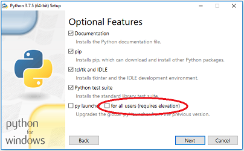
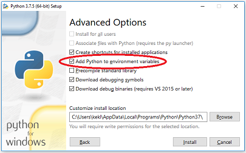
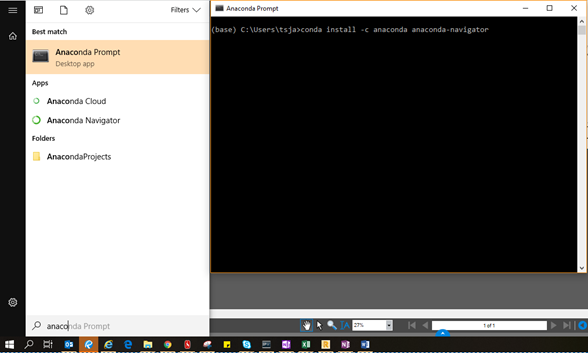

# Try Python without installation

If you want to try out the basics without installing Python on your PC, try the online interpreter in this link:

> <a href="https://www.onlinegdb.com/online_python_interpreter" target="_blank">https://www.onlinegdb.com/online_python_interpreter</a>

Make sure to select Python 3 as language in the top right of the site.

You'll be able to follow along with the first three sessions by this approach. Starting from Session 4 a dedicated Python installation and an editor is needed.

# Installation guide for Python environment

***Nov. 2019***
> ***Note:***
>_This guide does not nesessarily always refer to the latest released version._
>_Stable and well tested releases with high adoption among popular 3rd-party libaries are prioritised._
>_Also, there do exist alternative ways of installing Python. While, the section below describes the recommended method also presumed in the crash course, the most popular alternative are also described below._

## Recommended installation

This is the installation approach we recommend. Please skim through it before starting.

### 1. Download and install the basic Python application

A direct link to the installation executeable for Python 3.7.5 (64-bit) are given below.
On python.org you can find a more recent 3.8.0 release, but we do not yet recommend installing that.

> <a href="https://www.python.org/ftp/python/3.7.5/python-3.7.5-amd64.exe" target="_blank">https://www.python.org/ftp/python/3.7.5/python-3.7.5-amd64.exe</a>

Avoid installing it for all users, as this will require admin rights (also whenever installing 3rd-party packages in the future).



**Remember** to select the "Add Python to environment variables". In this way you don't have to navigate to the installation folder everytime you want to use Python.



### 2. Download and install Git (if you intend to use version control)

A direct link to the installation executeable for the latest Git 2.24.0 (64-bit) is given below (the official git homepage is git-scm.com).

> <a href="https://github.com/git-for-windows/git/releases/download/v2.24.0.windows.1/Git-2.24.0-64-bit.exe" target="_blank">https://github.com/git-for-windows/git/releases/download/v2.24.0.windows.1/Git-2.24.0-64-bit.exe</a>

### 3. Download and install a code editor

An code editor is the software interface supporting you in writing your code. This could in principle be Notepad, but much more advanced editors suited for programming exist with syntax highlighting, auto completion and much more. Note that you're free to change editor at any time.

We recommend that you start with **Visual Studio Code (VS Code)**, the now most popular free code editor in the world. A direct link to the installation executeable is provided below.

> <a href="https://aka.ms/win32-x64-user-stable" target="_blank">https://aka.ms/win32-x64-user-stable</a>

To set up Visual Studio Code properly to run Python scripts, follow this guide from Step 2: [VS Code Python setup](#Visual-Studio-Code---Installation).

> **Note:** For users who come from Matlab and want a similar editor experience, another editor called Spyder might be a good choice. If you want to go this route, follow the alternative installation below, as Spyder works best with that approach.

## Alternative installation - Miniconda

Miniconda is a lightwieght version of a common distribution of Python called Anaconda, it's supposed to be a more user friendly installation. This installation makes it easy to work in an editor called Spyder, which has a lot of similarities with the Matlab environment.

### 1. Download and install Miniconda

Choose the installer file with Python 3.7 that suits your Windows system from this site:

> <a href="https://docs.conda.io/en/latest/miniconda.html" target="_blank">https://docs.conda.io/en/latest/miniconda.html</a>

In the installation section called *Advanced Installation Options*, check the box saying _Add Anaconda to my PATH environment variable_. It will say that it's not recommended, but do it anyway.


Other than this, just choose defaults for the installation.

### 2. Install Anaconda Navigator

Go to Windows Start, type `anaconda prompt` and open the program. Don't get scared by the DOS-look.
In the program, type
```
conda install -c anaconda anaconda-navigator
```
and press enter to install. Type `y` when it asks.



### 3. Install editor

An editor is the software where the actual code is written. This could in principle be Notepad, but much more advanced editors suited for programming exist. These have syntax highlighting, auto completion while typing and much more.

Shipped with the Anaconda Navigator comes an easy way to install two editors:

### Visual Studio Code (VS Code)

***Recommended editor for people taking the 201 course***

* Many features and customization options
* Open-source project by Microsoft
* Very good Git integration for version control
* Support for many lanuages, not just Python

This is the editor KEKL and TSJA will be using.

### Spyder

***Recommended editor for people who wants a Matlab-like environment***

* Easier to understand for beginners, especially when coming from Matlab
* Has a varaible explorer and an interactive console that works with variables defined in the environment
* Has *some* Git intregation for version control, but not as developed as VS Code
* Support primarily for Python

> **Note:** If you don't like one editor you can always install the other later.

### Visual Studio Code - Installation

1. **Install Visual Studio Code from Anaconda Naviagtor.**

    If it's already installed the button will say "launch" instead of "install".

2. **Setup editor for running code**
    * Launch the editor and go the the _Extensions_ tab on the left panel (short key: <kbd>CTRL</kbd>+<kbd>SHIFT</kbd>+<kbd>X</kbd>)
    * Make sure that the extension called Python is installed, which it should be already (Note that this editor that support all programming languages, not just Python)
    * Search for and install the extension called _Code Runner_.

3. **Select the Python version to connect to VS Code**
    * This might seem unnecessary, but some people have many versions of Python installed on their system.
    * Go to _View_ -> _Command Palette_. Write `Python: Select Interpreter` and choose the interpreter (there should only be one at this point):

    * In case nothing shows up when you search "Python: Select Interpreter", try reinstalling the Python extension.

4. **Create a Python file and run it**
    * Go to _File_ -> _New file_. In the file write: `print('Hello world!')`. Save it and choose Python as file type in the dropdown.

    * After saving you should see the syntax highlighting take effect.

    * Press <kbd>CTRL</kbd>+<kbd>ALT</kbd>+<kbd>N</kbd> to run the script. The output in the bottom of the screen should now say `'Hello world!'`

> **Note:** If you get the error `'python' is not recognized as an internal or external command`, try restarting the editor. Sometimes it requires a restart for the interpreter setting to take effect.

Everything should now be ready!

After using it for a while, you might get annoyed by having to save the file before each run of the script. If you want to save it automatically before running, do this:

Go to the gear icon in the bottom left -> Settings -> Text Editor and scroll down to Edit in settings.json. Open the link and add this line in between the curly brackets:
```python
"code-runner.saveFileBeforeRun": true,
```

### Spyder - Installation

1. **Install Spyder from Anaconda Naviagtor.**

    If it's already installed the button will say "launch" instead of "install".

2. **Create a Python file and run it**

     Spyder will already have a `temp.py` file created. Write `print('Hello world!)` and use the green arrow to run the code.
    You can also create your own file as `some_name.py` and run the command in that.
