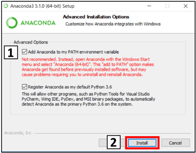

# Try Python without installation

If you want to try out the basics without installing Python on your PC, try the online interpreter in this link:
> https://www.onlinegdb.com/online_python_interpreter

Make sure to select Python 3 as language in the top right of the site.

# Installation guide
***Oct. 2019***

> ***Note:***
>_As new versions are constantly being released, this guide might not be fully up-to-date._
>_There are multiple ways of installing Python. The method described below is just one way that comes with some benefits_

## Anaconda and Minoconda
We will be using a common distribution of Python called Anaconda, which includes some benefits and pre-setup compared to installing directly from the Python website. We use a minimal installer called Miniconda, which is a lightweight version of the bigger Anaconda.

**Note:** If you already have a working installation of Python on your system that you are comfortable using, you don't need to follow this installation guide.

##### 1.  Download and install Miniconda
Choose installer file with Python 3.7 that suits your Windows system from this site:
>https://docs.conda.io/en/latest/miniconda.html

In the installation section called _Advanced Installation Options_, check the box saying _Add Anaconda to my PATH environment variable_. It will say that it's not recommended, but do it anyway.


Other than this, just choose defaults for the installation.

##### 2.  Install Anaconda Navigator
Go to Start, type `anaconda prompt` and open the program. Don't get scared by the DOS-look.
In the program, type
```
conda install -c anaconda anaconda-navigator
```
and press enter to install. Type `y` when it asks.


##### 3.  Install Editor
